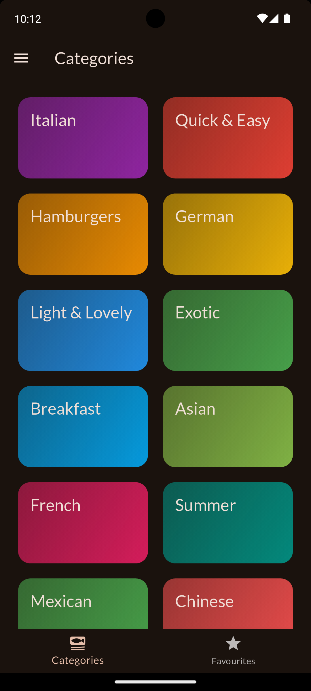
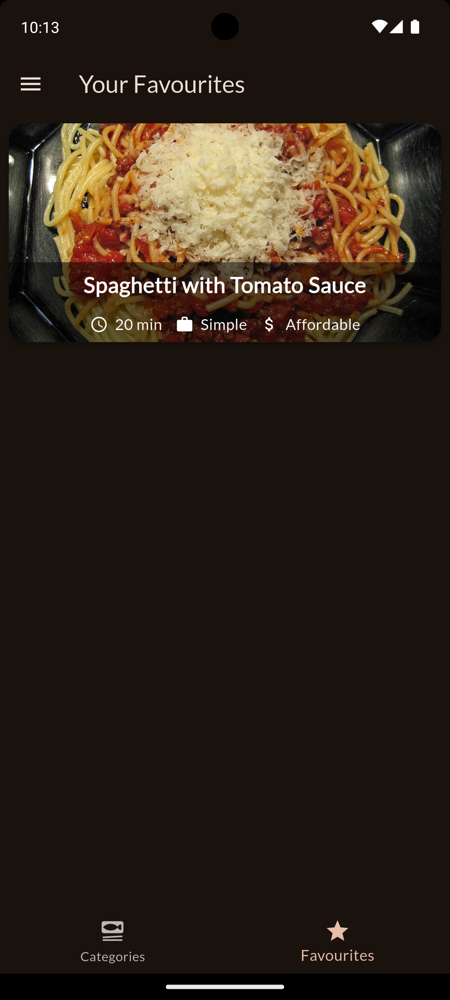
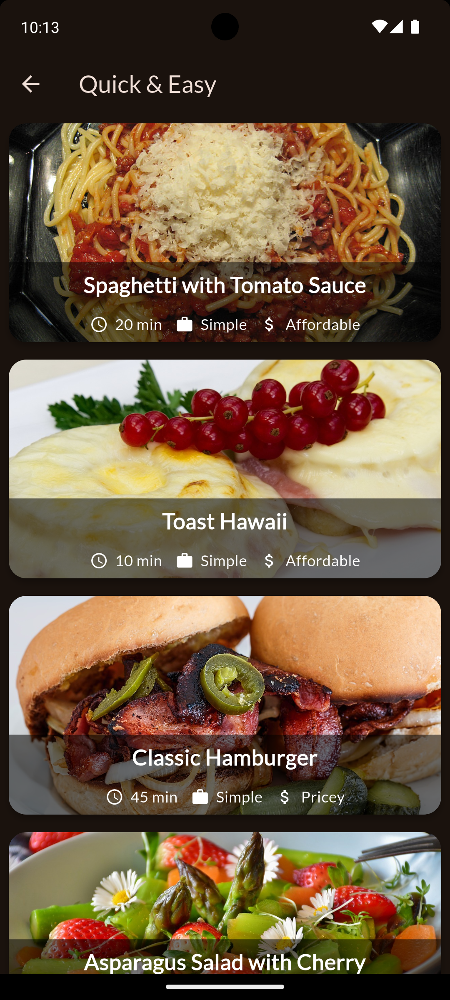
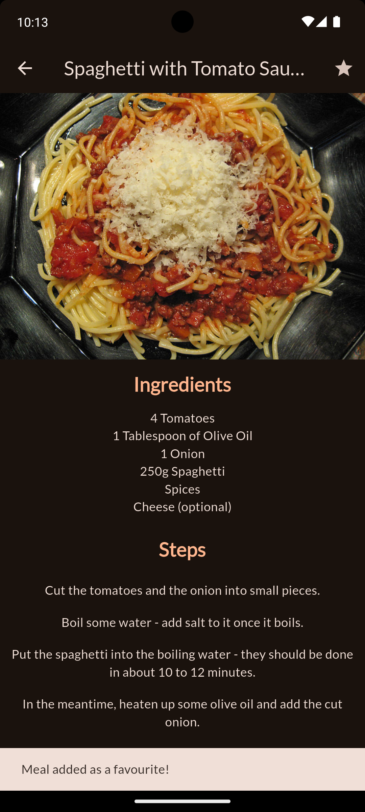
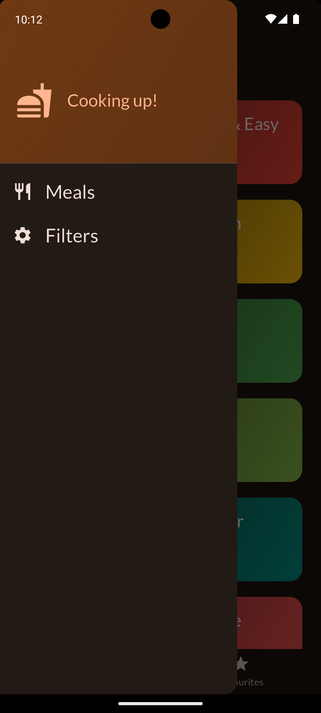
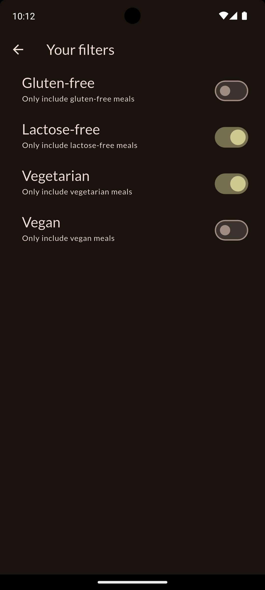

# Meals App

## Table of Contents
- [Introduction](#introduction)
- [Features](#features)
- [Technologies Used](#technologies-used)
- [Setup Instructions](#setup-instructions)
- [Usage](#usage)
- [Screenshots](#screenshots)
- [Credits](#credits)
- [Contact](#contact)

## Introduction
A simple Flutter project that provides a multi-screen interface to view different meals across different categories, allows filtering of meals and adding favourite meals.

## Features
 - A multiscreen animated meals app that uses GridView, NetworkImage and various other widgets like InkWell, Navigationbar, Drawer, SwitchTileList etc. Project made as a part of learning Flutter.
 - It does use Riverpod package for cross state widget management. Instead of the function being passed down through various widgets from the parent widget to the actual widget where it is going to be used   
   (cumbersome method), a separate providers.dart file can be created which can provide a particular static/dynamic value(variable) and it's associated methods to modify this value throughout the whole project. 
   Thus passing of values from one widget to another becomes a much easier task when a common provider file handles such common values required in multiple widgets. 
 - Multiple provider files can be created for multiple such values and the StateNotifier with StateNotifierProvider class can be used for handling dynamic values and making functions for managing the changing 
   state/value of the variables it provides.
 - The files that want an access to the variables provided by these provider files must use the read() or watch() function. The read() function is only executed once and thus can be used in initState() function 
   or anonymous functions < (){} > used in onPressed or onTap like attributes. While the read() function is executed as many times as the state of the value it provides changes. It also calls the corresponding 
   build() in which it is present to update the UI changes accordingly. 
- **View meals:** Allows for viewing of meals of different categories and details of meals regarding how easy they are to prepare, how costly they are and finally instructions and steps to make those meals.
- **Filtering of meals:** Users can filter meals if they want to see lactose-free, gluten-free, vegetarian or vegan meals amongst the overall list of meals.
- **Add to favourites:** Users can add the meals to their favourites which are shown irrespective of whether the initial filters are applied or not.

## Technologies Used
- **Flutter:** Framework and its various packages.
- **Dart:** Primary programming language.

## Setup Instructions
1. **Install Flutter and Android Studio:**
    Make sure you have the necessary requirements to run a Flutter app on your local machine. Flutter framework, its extensions in VS Code, Android Studio, android emulator (from Android Studio) to run your apps and see them how they look on screens (Alternatively, you can run apps on your actual mobile devices too).

2. **Clone the repository:**
   Type the following commands in your terminal after you have directed it to a particular directory.
   
   - git clone https://github.com/amaanshaikh2114/Meals.git

    
## Usage
1. **Run the application:**
    Go to the directory where you have placed the project and type 'flutter run' in the terminal. Ensure flutter is recognized by your system by making sure it's in the 'Path' option of System variables by going to the environment variables of your system.

2. **Apply filters:**
    To apply filters and view corresponding meals use the drawer at the top left to open the drawer and select 'Filters'. Apply necessary filters and view meals that fall in those categories.

3. **View meals and favourites:**
   Click on different categories to view filtered meals that fall in each category. Open a particular meal to get the meal details.

4. **Add to favourites:**
    To add/delete a meal to/from favourites use the star icon button at top right corner of every meal. Use bottom navigation bar to view favourite meals in the favourites section.
   

## Screenshots

  
  
  
  
  
  

## Credits
'Flutter & Dart - The Complete Guide [2024 Edition]' Course by Maximilian Schwarzmüller on Udemy.

## Contact
For any questions or inquiries, please contact [Amaan Shaikh](mailto:amaanmazhar211@gmail.com). Send a mail to amaanmazhar211@gmail.com
